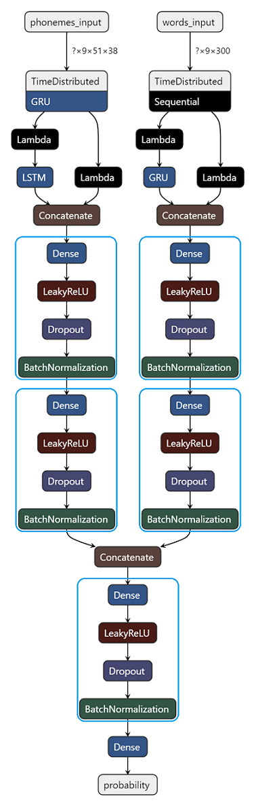

# PoemesProfonds

## Requirements

- Python >= 3.5
- Tensorflow 2
- Keras >= 2.3.1
- Java 1.8


## Text-to-phenomes converter

In order to get the phonemes of the verses from the poetry, a text-to-phonemes converter for French need to be developped. Some words, especially proper nounds, may appear in poetry but are not in any database containg the phenotic of these novel words. Thus, a model based on neural networks was created so converter can read every word. This algorithm can also be used to generate songs lyrics.

The data to train the model on was found in [1]. Instead of using the International Phonetic Alphabet (IPA), the same substitution alphabet is used as in [1] as described below. 

### Consonants

|IPA symbol            |k|p|l|t|&#641;|f|s|d|&#658;|n|b|v|g|m|z|&#643;|&#626;|&#627;|x|
|----------------------|-|-|-|-|------|-|-|-|------|-|-|-|-|-|-|------|------|------|-|
|Corresponding character|k|p|l|t|R     |f|s|d|Z     |n|b|v|g|m|z|S     |N     |G     |x|

### Voyels and Semi-voyels
|IPA symbol            |a|&#603;|&#596;~|j|o|&#596;|i|&#339;~|&#603;~|e|u|&#593;~|&#601;|&#339;|w|y|&#613;|&oslash;|
|----------------------|-|------|-------|-|-|------|-|-------|-------|-|-|-------|------|------|-|-|------|-|
|Corresponding character|a|E     |§      |j|o|O     |i|1      |5      |e|u|@      |°     |9     |w|y|8     |2|

The model can take as input a word up to 25 lettres long and return a phonetic transcription up to 21 phonemes long.

The architecture of the model features an attention mechanism [2].

The model has a **99.76% accuracy** on words it was not trained on which seem to be the best (as of August 2020) in French.

A class **Lecteur** was developped to read the texts. It uses dictionnaries mapping words to phonemes. The words already present in the data used to train the model are not read by the model. The algorithm uses the phonemes in the data. This mapping in the dictionnary *dico_u*.

However, some words can have several pronounciations (*i.e.* "est" can be read /e/ or /&#603;st/). The algorithm uses a dictionnary mapping the word and its part-of-speech (POS) to the phonemes. This mapping is stored in the dictionnary *dico_m*. The keys are a tuple (word, POS).

Therefore, only words absent of these dictionnaries are read by the model.

### Installation

```python
import preprocessing as pp
from lecture import *
from keras.models import load_model

dico_u, dico_m, df_w2p = pd.read_pickle(os.path.join(".", "data", "dicos.pickle"))
ltr2idx, phon2idx, Tx, Ty = pp.chars2idx(df_w2p)
model_lire = load_model(os.path.join(".", "models", "lecteur", "CE1_T12_l10.h5"))
lecteur = Lecteur(Tx, Ty, ltr2idx, phon2idx, dico_u, dico_m, n_brnn1=90, n_h1=80, net=model_lire, blank="_")
```
### Usage

There are three main methods in the class *Lecteur*.

Method **lire_nn** returns a dictionnary mapping words to phonemes using only the neural network model.

```python
>>> lecteur.lire_nn(["cheval", "abistouque"])
{'cheval': 'S°val', 'abistouque': 'abistuk'}
```
Method **lire_mots** uses words POS and the dictionnaries *dico_u* and *dico_m* besides the model to read words. It returns a list containing the phonetic transcriptions of the words.

```python
>>> lecteur.lire_mots(["cheval", "abistouque"])
['S°val', 'abistuk']
```

As this text-to-phonemes converter was developped to read French poetry, the phoneme /&#601;/ is added when a word ends with a consonant sound followed by a mute *e* (except at the end of a verse). This was added thanks to the functions *e_final* and *e_final_tokens* used in the method *lire_vers*. Theses /&#601;/ are nor present in the dictionnaries *dico_u* and *dico_m* neither in the model.

Method **lire_vers** also features the [French *liaisons*](https://en.wikipedia.org/wiki/Liaison_(French)). The POS is considered while applying the *liaison* or not. For instance, with *les enfants ouvrent* there is no *liaison* between *enfants* (noun) and *ouvrent* (verb). The POS-tagger used is [*StanfordPOSTagger*](https://nlp.stanford.edu/software/tagger.shtml) [6]. Because of it, only a single sentence shoud be input in the method.

Numbers can also be read thanks to a script broadly inspired by [3].

```python
>>> lecteur.lire_vers("Les trains arrivent en gare de Jarlitude, voies 14 et 97.")
'letR5aRiv°t@gaR°d°ZaRlityd°vwakatORzekatR°v5disEt'
```
## Best sequence of verses

This project was inspired by [4]. The aim of this project is to get a realistic sequence of verses from a neural network. This models look at a set of previous verses to get the most likely verse to continue this sequence. Some verses are candidates to be chosen as the best sequel. The model predicts a score for each candidates. Here, it is the probability of the verse to be the sequel.

Unlike in [4], the neural network reckons a verse as a couple of its phonemes (got thanks to the text-to-phonemes converter) and its FastText representation. FastText [5] is a word embedding representation which can derive a unique vector for a sentence. It also considers the punctuation and it is case-sensitive. This allows the model to make more realistic predictions as it considers these elements.

### Data

As the neural network creates a sequences of verses, theses verses need to be stored in a data frame. Each observation is a verse. For the training, the verses should be ordered in the data frame. The verse line  is in its original poem right before the verse line  and right after the one line .

The data frame needs at least these four variables (their names can be changed while creating an instance of *Chercheur2Vers*):

- vers: raw text of the verse
- phonemes: phonemes of the verse
- id: identifying number of the poeme from which the verse is from. (Only needed for training)
- vect: FastText representation of the verse. The models are built to use 300-dimension vectors.

This is an example of the data:

| vers                           | phonemes          | id | vect      |
|--------------------------------|-------------------|----|-----------|
| Que les parfums légers de ton air embaumé, | k°lepaRf1leZed°t§nER@bome | 23 | (0.001, ..., 0.03) |
| Que tout ce qu'on entend, l'on voit ou l'on respire, | k°tus2k§n@t@l§vwatul§REspiR | 23 | (0.2, ..., 0.004) |
| Tout dise : Ils ont aimé ! | tudizilz§teme | 23 | (0.052, ..., 0.14) |
| Comme je descendais des Fleuves impassibles, | kOm°Z°des@dEdefl9vz5pasibl | 55 | (0.092, ..., 0.74) |
| Je ne me sentis plus guidé par les haleurs : | Z°n°m°s@tiplygidepaRleal9R |55 | (0.0001, ..., 0.02) |
| Des Peaux-Rouges criards les avaient pris pour cibles | depoRuZ°kRijaRleavEpRipuRsibl | 55 | (0.096, ..., 0.032) |

In order to have a huge amount of verses, the idea was to get French classical plays. They were got from the website *Théâtre classique* [8] through XML files format.

### Neural network

The aim of the neural network is to compute, for a set of  verses, the probability that a verse is the real one following this set.

#### Inputs

These verses are modeled by two different matrixes:

- : one hot encoding representation of the phonemes of the verses. Its shape is .  is the size of the longest string of phonemes among the data.  is the number of characters of the phonemes alphabet. One is added to  as the matrix holds the representations of the  verses of the set and the one of the verse for which we want to compute the probability. One is also added to  as there is a symbol for a blank.
- : stack of FastText representations of the verses. Its shape is  with  the dimension of the FastText vectors.

#### Phonemes

A gated recurrent unit (GRU) layer is used to compute an embedding for each verse's phonemes. This type of layer was chosen because it considers a the order of the phonemes to create the embedding. GRU layers have proven to be efficient while having less parameters to train than long short-term memory layers. Its activation is the hyperbolic tangent. The layer turns every of the  rows of the matrix  from a -shaped matrix to a vector of dimension . This layer creates a -shaped matrix. The last row is extracted from this matrix. So that a new -shaped matrix , representing the set of  verses, and a -dimension vector, reprensenting the candidate verse, are created.

A long short-term memory (LSTM) layer is applied on the matrix . It creates an embedding of the set of  verses from which to find the best sequel. This embedding is a -dimension vector. LSTM was chosen as it has an additionnal cell state vector which can be useful while creating an embedding considering better enclosing rhymes (*rimes croiées* and *rimes embrassées*). Once the set of  verses is embedded, it has to be concatenated to the embedding of the verse which is a candidate for the sequel. This concatenation, a gives a -dimension vector which represents the set of  verses and the candidate verse.

A fully-connected layer with  is applied on the output of the previous concatenation. Another fully-connected layer with  units derives the ultimate embedding of the phonemes of the  verses and the candidate verse. A leaky rectified linear unit with &alpha; = 0.2 is used as the activation function for these fully-connected layers. These layers are regularized with a 10% dropout. A batch normalization is also applied on these fully-connected layers to avoid vanishing or exploding gradients.

#### FastText

The only architectures producing realistic results, were the ones which were symetric. That is to say that for both the phonemes and the FastText representation sides, the output of each layer needs to be of the same size. Thus, each verse's FastText representation needs to be turned into a -dimension vector. Therefore, the matrix  is turned into a  shaped matrix called. A fully-connected layer with  units derives the embedding of the same size that the one of the phonemes. The output of the layer is normalized in order not to have some FastText representations to activate more the next layers and thus to be more likely to be picked as a sequel, even though they are not the most realistic ones. Indeed, shorter verses seem to have FastText representations with a norm closer to 1 than the longer verses. Thus, shorter verses were more likely to be picked up by the model. This normalization can be considered as the activation function. A 10% dropout regularization and a batch normalization are applied to the output of this layer.

Similarly to the phonemes side, the  shaped matrix is split into a  shaped matrix, called ,  and a -dimension vector.   represents the set of  verses and the vector the candidate verse.  is input to a GRU layer. It creates an embedding of  dimensions. The GRU can capture a suitable embedding of the theme and the grammatical natures (like gender and number) of the  verses. The GRU may give more weight to the last verse or understand a pattern between each verse. Unlike the phonemes, side which had a LSTM, the additional cell state was not needed as the the theme and nature should be continuous from a verse to the next one.

Like the phonemes side, the candidate verse and the  verses embedding are concatenated into a single -dimension vector. It goes through two fully-connected layers with respectively  and  units. Each layer has a leaky rectifer linear unit with &alpha; = 0.2. They are regularized with a 10% dropout. A batch normalization is also applied to booth outputs.

#### Concatenation

The embeddings from booth the phonemes and the FastText sides are concatenated. This derives a -dimension vector. This vector is input to a fully connected layer with  units. Its activation function is again a leaky rectifier linear unit with &alpha; = 0.2. Again it is regularized with a 10% dropout. A batch normalization is applied to the output of this layer.

This -dimension vector feeds the last layer which has a single unit and is fully-connected. Its activation function is the sigmoid. Thus the number is the probability of the candidate verse to be the sequel of the  verses.

Bellow, the diagram of the architecture




### Writing

In order to have enclosing rhymes, the poem written will not keep only the most likely verse after having applied the neural network model. Similary to machine translation, a beam search algorithm is used here to keep the  best sequences of verses which were derived by the model. Then, the model uses these  sequences as the set of  and compute the best sequel for eqch of them. The code is inspired from [7].

### Usage

Two parameters are important for the quality of the poem generated and the speed of execution:

- **test_size**
- **k**


## References
[1] [New, Boris, Christophe Pallier, Ludovic Ferrand, and Rafael Matos. 2001. "Une Base de Données Lexicales Du Français Contemporain Sur Internet: LEXIQUE" L'Année Psychologique 101 (3): 447-462](https://chrplr.github.io/openlexicon/datasets-info/Lexique382/New%20et%20al.%20-%202001%20-%20Une%20base%20de%20donn%C3%A9es%20lexicales%20du%20fran%C3%A7ais%20contempo.pdf)

[2] [Vaswani, A., et al.: Attention is all you need. arXiv (2017). arXiv:1706.03762](https://arxiv.org/pdf/1706.03762.pdf)

[3] [Michel Claveau. 2004. "Traduction nombre => texte" from mclaveau.com](http://mclaveau.com/ress/python/trad.py)

[4] [E Malmi, P Takala, H Toivonen, T Raiko, A. Gionis. 2016. DopeLearning: A Computational Approach to Rap Lyrics Generation. arXiv preprint arXiv:1505.04771](https://arxiv.org/pdf/1505.04771.pdf)

[5] [Tomas Mikolov, Edouard Grave, Piotr Bojanowski, Christian Puhrsch, and Armand Joulin.   Advances in pre-training distributed word representations.  InProceedings of the Eleventh International Conference on LanguageResources and Evaluation (LREC-2018), 2018.](https://arxiv.org/pdf/1712.09405.pdf)

[6] [Kristina Toutanova, Dan Klein, Christopher Manning, and Yoram Singer. 2003. Feature-Rich Part-of-Speech Tagging with a Cyclic Dependency Network. In Proceedings of HLT-NAACL 2003, pp. 252-259.](https://nlp.stanford.edu/~manning/papers/tagging.pdf)

[7] [Jason Brownlee. January 5 2018. "How to Implement a Beam Search Decoder for Natural Language Processing" from machinelearningmastery.com](https://machinelearningmastery.com/beam-search-decoder-natural-language-processing/)

[8] [Théâtre classique](http://theatre-classique.fr/pages/programmes/PageEdition.php)

## License
